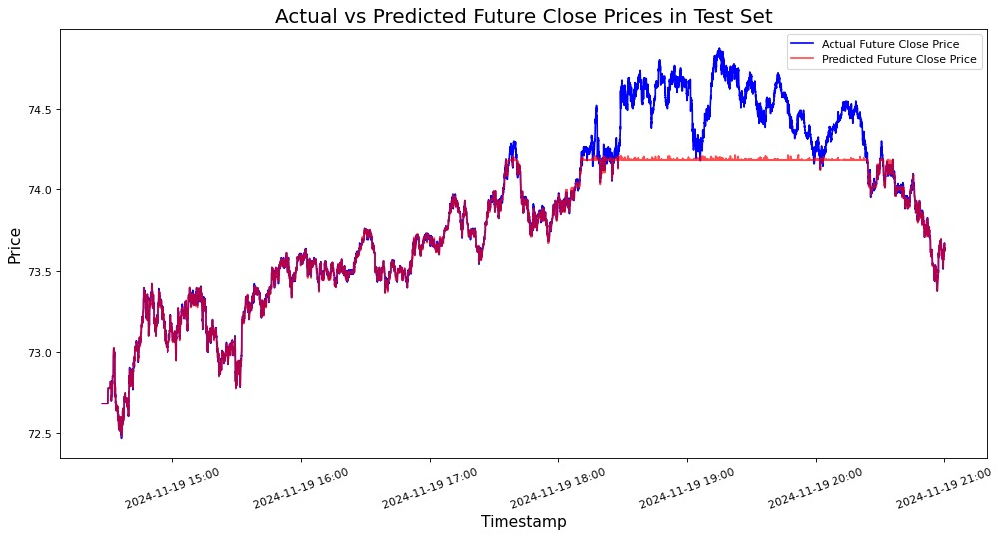
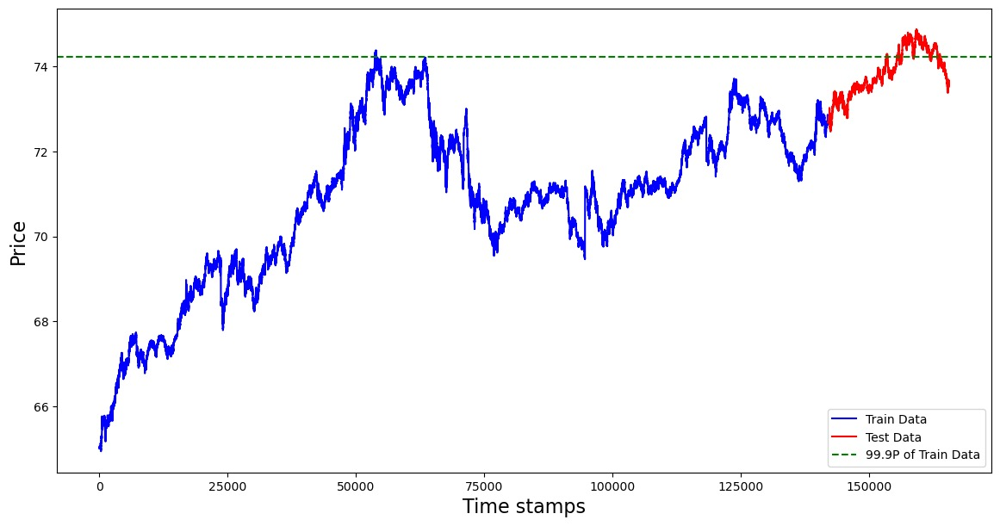

# Alogrithm Trading Strategies 

## Team

**Jun Sang**

- Hi, I am a second year master student majoring in Mechanical Engineering at University of Illinois at Urbana-Champaign. I am currently submitting my paper which is related about development of phase change materials with superior thermal stability and form retention. I am also applying for PhD in Mechanical Engineering at University of Illinois at Urbana-Champaign. 
Email : junsang5@illinois.edu

**Kejie Zhao**

- Hello, I’m a first-year PhD student at Informatics with a research focus of applied deep learning in geoscience, remote sensing and environmental science. I also had 2-year work experience as a software engineer in Microsoft. 
Email: kejiez2@illinois.edu

**Krish**

- Hi! I am a junior double majoring in Computer Engineering and Statistics at the University of Illinois at Urbana-Champaign. I am currently looking for SWE/quant intership roles for the Summer of 2025.
Email:
School - krishkg2@illinois.edu
Work - kjg2352@gmail.com

**Nhi Dinh (Team Leader)**
- I am a sophomore majoring in Statistics and Computer Science major and Mathematics minor at University of Illinois Urbana Champaign graduating in May 2026. I am currently looking for intern job opportunities in the research area as well as applying for graduate schools in Statistics/ Mathematics. My primary interst is in designing algorithms that optimize usage and efficiency. 

Email: nhidinh2@illinois.edu


## Project Overview

The cryptocurrency market, known for its high volatility and rapid trading dynamics, offers both significant opportunities and unique challenges for algorithmic trading. Our project focuses on developing algorithmic trading strategies using nanosecond-accurate data. We aim to generate visualizations and analyze the performance of our strategies for intraday trading. 


1. **Data Retrieval and Parsing**  
   We rely on IEX as the main market data source for this project. Professor Lariviere's IEX data downloader and parser have been adopted to facilitate efficient data retrieval and parsing.

2. **Machine Learning Development**  
   Our framework incorporates XGBoost to predict short-term price movements. Advanced feature engineering techniques are employed to enhance prediction accuracy.

3. **Strategy Implementation**  
   We use Strategy Studio, a proprietary trading strategy development and testing platform from RCM, as the foundation for our work. By implementing interfaces such as the `Strategy` class within Strategy Studio, we create and test new trading strategies. The strategy logic incorporated a risk management layer to minimize potential losses, which dynamically adjusted trade sizes based on the model's confidence score.
   
4. **Visualization**  
   The backtesting process generates key files—fills, and profit-and-loss—which are analyzed to evaluate strategy performance. The results are visualized to provide clear insights into the effectiveness of our trading strategies. The visualizations include not only performance metrics but also a comparison of cumulative returns across different trading scenarios, highlighting the adaptability of the implemented strategies.

**Repository Layout**

```bash
.
├── Final Report.md
├── README.md
├── Jenkinsfile
├── models
│   ├── Crypto_Pred_XGBoost.ipynb
│   ├── model.py
│   ├── best_xgb_model.json
├── iexdownloaderparser
├── XGBoost
│   ├── XGBoost.cpp
│   ├── XGBoost.hpp
│   ├── Makefile
│   ├── compile_and_backtest.sh
│   ├── xgboost
├── visualization
│   ├── backtesting_visualization.ipynb
│   ├── data
│   │   └── ...csv
│   ├── output_charts
│   │   └── ...png
├── pictures
│   ├── error_investigation.jpg
│   ├── feature_importance.jpg
│   ├── price_prediction.jpg
├── strategy
│   ├── strategy.cpp
│   ├── strategy.hpp
│   ├── Makefile
│   ├── go.sh
├── Technologies Research
│   ├── Strategy Studios Documentation
│   │   └── ...
│   ├── Strategy_Studio_Demo_notes.pdf
```

## Project Details

### 1. Data Collection 

We integrated and customized the Professor's IEX downloader/parser as a submodule for our project. This tool facilitates the downloading of DEEP and TRADE data from the IEX exchange, which can be directly used in Strategy Studio for strategy development and backtesting. While the original version of the IEX downloader/parser can be accessed [here](https://gitlab.engr.illinois.edu/shared_code/iexdownloaderparser), we recommend using our modified version, as it has been optimized to align seamlessly with our ML framework.

```bash
parser
└── iex_parser
    ├── src
        ├── download_iex_pcaps.py
        ├── parse_compress_iex_pcaps.py
        ├── parse_iex_caps.py
        ├── stockbook.py
    ├── README.md
    ├── download.sh
    ├── parse_all.sh
    
```

**Usage** 

(For our model we recommend to book_updates data for 6 days consecutive then we can back testing out tick for the 7th day)

1. To download data within a *specific range*, edit the `start-date`  and `end-date` arguments in `download.sh`:

   ```bash
   python3 src/download_iex_pcaps.py --start-date 2024-11-12 --end-date 2024-11-17 --download-dir data/iex_downloads
   ```
2. To specify the *company symbols*, edit the `--symbols` argument in `parse_all.sh`. The default is SPY only, but you can add more:

   ```bash
   gunzip -d -c $pcap | tcpdump -r - -w - -s 0 | $PYTHON_INTERP src/parse_iex_pcap.py /dev/stdin --symbols GBTC --trade-date $pcap_date --output-deep-books-too
   ```
3. Run `./parse_all.sh` to parse IEX deep data. Result will be stored under `iexdownloaderparsers/data` 

4. The `20241112_book_updates.csv` (*or your custom data file*) is preprocessed and ready for use in the XGBoost model.

5. The `tick_GBTC_20241118.txt` (*or your custom data file*)  is ready to be imported into Strategy Studio.


### 2. Machine Learning Strategy

**Model Selection**

XGBoost, short for Extreme Gradient Boosting, is a powerful machine learning algorithm, popular for its efficiency, scalability, and robust performance in tasks like classification, regression, and ranking. Rooted in the principles of gradient boosting, it builds models sequentially, where each subsequent model corrects the errors of its predecessor to enhance overall accuracy. However, traditional gradient boosting methods often face challenges like overfitting, particularly with complex datasets. XGBoost overcomes these limitations through innovative features that significantly improve its performance and reliability: 

- Regularization: XGBoost incorporates regularization techniques to penalize overly complex models, effectively reducing overfitting and ensuring generalization to new data.
- Parallel and Distributed Computing: Unlike traditional gradient boosting, XGBoost can build trees simultaneously, greatly accelerating training and enabling it to process large-scale datasets efficiently.
- Tree Pruning: XGBoost uses maximum-depth pruning to create balanced decision trees that effectively capture patterns without becoming overly complex.
- Weighted Quantile Sketch Algorithm: This feature allows XGBoost to determine optimal splits quickly and accurately, enhancing performance in handling intricate and large-scale datasets.

**Feature Engineering**

In this project, we used a resampling interval of 0.5 seconds to create a consistent dataset for predicting close prices over the same time horizon. Key features include: 

- Current OHLC Prices: The latest open, high, low, and close (OHLC) prices provide essential real-time market insights.

- Rolling Statistics: Calculated over 20 steps (10 seconds), these include the rolling mean, standard deviation, minimum, and maximum of close prices, as well as order book imbalance and spread statistics. These features capture short-term trends, volatility, market liquidity, and sentiment

- Exponential Moving Averages (EMA): EMAs with spans of 3, 5, and 8 steps emphasize recent price changes, offering a nuanced view of momentum and trends over short to medium timeframes.

- Lagged Close Prices: By including lagged close prices from 1-3 steps earlier, the model can identify temporal patterns like momentum and mean reversion.

- Relative Strength Index (RSI): Computed over 20 steps, the RSI measures momentum, helping the model detect overbought or oversold conditions that might indicate reversals.

- Moving Average Convergence Divergence (MACD): Derived from the difference between the 5-step and 10-step EMAs, the MACD highlights the interplay between short- and long-term price trends, aiding in the identification of trend reversals and momentum shifts.

- To ensure robustness, feature correlations were evaluated to eliminate redundant or less impactful inputs, enhancing model efficiency and prediction reliability.

**Results**

In this project, the first six days of data were designated for training the model and the remaining seventh day was reserved for evaluation. 

Hyperparameter tuning via random search optimized parameters like learning rate, tree depth, and estimators, completing training in *162* seconds on an M1 Pro MacBook Pro. Inference took just 0.03 seconds per entry. Cross-validation was employed to mitigate overfitting and ensure consistent model performance across diverse market conditions.

Model performance was assessed using Mean Squared Error (MSE) and the coefficient of determination (R² score). The model achieved an MSE of *0.043* and an R² score of *0.86*, indicating that 86% of stock price variability was explained. A comparison of predicted vs. actual prices is shown below.
 
 

The top 10 features influencing the XGBoost model are shown below. Shorter-span exponential moving averages of the close price (e.g., spans of 3 and 5 steps) were most predictive, followed by traditional OHLC prices and rolling statistics, such as rolling maximum, rolling mean, and lagged close prices. These features help capture short-term trends and market fluctuations.

 

As seen in Figure 1, the model struggles to predict accurately when prices exceed 74, near the historical maximum observed during training (Figure 3). This limitation stems from the model's reliance on the range of training data. To improve performance in new market regimes, the model needs regular updates or retraining with recent data. The evaluation metrics indicated that certain feature combinations, such as bid-ask spreads and rolling averages, played a critical role in achieving higher prediction accuracy during periods of increased volatility. One great advantage of our proposed method is that the re-training will only take a few minutes.

 

**Usage** 

1. Run Crypto_Pred_XGBoost.ipynb with your 6-day training dataset `iexdownloaderparsers/data/20241112_book_updates.csv` (*or your custom data file*) to train the model. Save the trained model as a JSON file for use with Strategy Studio if required.

2. Execute `model.py` to generate predictions for the next timestamp (where each timestamp is 1 second).

### 3. Implementation 

**Loading the Model Using XGBoost’s C API**

Once the model is trained, it is saved in a JSON file for portability. To integrate the model into a C++ application, the XGBoost C API is installed and configured correctly. Input data is then prepared by formatting it as a DMatrix, which is the standard data structure for XGBoost. Then, predictions are subsequently generated using the XGBoosterPredict function, enabling real-time decision-making or analysis.

```
├── Jenkinsfile
├── strategy
│   ├── strategy.cpp
│   ├── strategy.hpp
│   ├── Makefile
│   ├── go.sh 

```

**Integration with Strategy Studio for Backtesting**

Many technologies were used in tandem to backtest the strategy. First, we ran a virtual machine running Ubuntu 20.04. A Jenkins pipeline was then setup to pull the code from the GitLab repo, run the backtest, then push the results back to the GitLab. The 'strategy' is implemented in C++ and is run on Strategy Studios. To help with this process, I also wrote a Makefile, as well as some shell scripts. All of these work together to make the process run smoothly.

NOTE: This process currently has some bugs in it, but I am hoping professor leaves me with access to these resources, so I can solve them. 

### 4. Analysis 

We analyze trading performance metrics by calculating key indicators such as the Sharpe ratio, maximum drawdown, and cumulative returns. These metrics provide a detailed overview of the trading strategy's risk-adjusted performance and profitability. Additionally, we visualize key trends, including PnL over time and intraday price movements, offering actionable insights into trading dynamics.

**Usage** 

1. Provide the file paths for StrategyStudio outputs.

2. Run `backtesting_visualization.jypnb`. 

3. Numerical summaries and visualizations are automatically saved in the`output_charts`directory. For deeper analysis, interactive plots can be generated using pyplot HTML exports, enabling a more flexible exploration of trends and metrics.


**Video Demo**

[Project Video link]()


## Conclusion & Reflections

### Kejie Zhao
1. **What did you specifically do individually for this project?**
- Selected the appropriate ML models using the order book data.
- Implemented feature engineering for model optimization.
- Trained and evaluated model performance, analyzing feature importance and why the model underperformed at certain price points.

2. **What did you learn as a result of doing your project?**
- The importance of feature engineering in building ML models for practical problems, sometimes being more crucial than the choice of the model itself.
- Gained experience integrating XGBoost with Strategy Studio in C++.

3. **If you had a time machine and could go back to the beginning, what would you have done differently?**
- Investigated feature engineering more deeply, exploring additional features from the order book data.
- Used a larger dataset (e.g., a month’s worth) to better evaluate model performance and investigate the need for updates or retention.
- Trained separate models for different assets.
4. **If you were to continue working on this project, what would you continue to do to improve it, how, and why?**
- Collect more data and train the model on a larger dataset to enhance performance.
- Continuously evaluate when retraining is needed.
- Incorporate external factors like election results or tweets from influential figures (e.g., Elon Musk) that could affect crypto prices.

### JunSang
1. **What did you specifically do individually for this project?**
- Collected Depth-of-Book data from the IEX exchange, ensuring that the data was complete, clean, and ready for processing.
- Worked on preprocessing the collected data, aligning it with the requirements for feature engineering and model training.
- Explored the use of Pybind to integrate machine learning models with Strategy Studio but decided against using it due to the complexity and inefficiency it introduced.

2. **What did you learn as a result of doing your project?**
- Gained a deep understanding of how to collect and process Depth-of-Book data, which revealed the surprising magnitude of data volume and its impact on computational requirements.
- Learned how feature engineering plays a critical role in enhancing machine learning models, including the importance of techniques like rolling averages and order book imbalance metrics.
- Discovered the challenges and trade-offs involved in integrating Python and C++ workflows through Pybind, gaining valuable insights into cross-language interface development.

3. **If you had a time machine and could go back to the beginning, what would you have done differently?**
- Focused earlier on understanding the computational and storage requirements of the data collection process to avoid bottlenecks during data preprocessing.
- Conducted a more detailed feasibility analysis of Pybind at the start to save time on its integration attempts and explore alternative solutions earlier.
- I would have collected more diverse datasets, covering additional stocks and cryptocurrencies, to improve the robustness and generalizability of the machine learning models.

4. **If you were to continue working on this project, what would you continue to do to improve it, how, and why?**
- I would revisit the integration of Pybind to explore its potential further. While it was initially set aside due to complexity, with more time and resources, it could enable more seamless communication between Python-based models and the C++ framework in Strategy Studio, improving flexibility and extensibility.
- Expand the training dataset to include a wider range of cryptocurrencies, enhancing the model’s robustness and reducing overfitting to specific market conditions.
- Incorporate real-time data streaming capabilities into the project to simulate a live trading environment, which would provide more realistic insights into the strategy's performance.


### Krish
1. **What did you specifically do individually for this project?**
- After ssh'ing into professor's Ubuntu VM, I created a Jenkins pipeline to git pull from the GitLab repository, use Strategy Studios to backtest the strategy, then push the output back to GitLab.
- I wrote the strategy utilizing Keiji's model and modifiied some shell scripts to help the process.

2. **What did you learn as a result of doing your project?**
- I learned many things as a result of this project. I learned how to utilize Jenkins and Strategy Studios. I learned more about ssh, security keys and how to debug ssh issues. I also learned more about Makefiles because, before this project, they were mostly a mystery to me. I also learned how to use XGBoost to use machine learning models trained in Python, in C++.

3. **If you had a time machine and could go back to the beginning, what would you have done differently?**
- Given my other time commits with finals and other courses' projects, I would have asked professor to have us start these projects earlier in the semester.
- Also, I would have liked to be team leader. I feel like this would have given me a chance to learn more.

4. **If you were to continue working on this project, what would you continue to do to improve it, how, and why?**
- First, I would fix the errors I have within the code. I would do this by asking people more knowledgable on Strategy Studios about the issues I am having.
- If I was to continue working on this project, I would expand it to more ticker symbols by I would increasing the training dataset. This would add some diversity to this trading strategy and make it less volatile.
- I would also add more modularity to the Jenkins pipeline, so it would be easier to backtest in the future if the strategy ever changes.


### Nhi Dinh
1. **What did you specifically do individually for this project?**
- I adapted the IEX data parser submodel, originally provided by our professor, to better align with our model's specific requirements.
- I handled the installation and configuration of the XGBoost C API and integrated it with StrategyStudio running on C++.
- I developed visualizations for analyzing the backtesting results from StrategyStudio, ensuring clear and insightful data representation. 
- I was responsible for the project's demo video and report documents. 

2. **What did you learn as a result of doing your project?**
- I gained in-depth knowledge about IEX exchange data, including its operational mechanics and the intricacies of data parsing, monitored through tools like Wireshark.
- I learned about the capabilities of XGBoost and the process of translating models from Python to C++, which involved significant adjustments and testing.
- I learned about the workings of Strategy Studio on a virtual machine (VM), particularly its integration and operation through C++ and WScript.

3. **If you had a time machine and could go back to the beginning, what would you have done differently?**
- Given the high computational demands of the project, I would opt for a more powerful machine from the outset to handle the tasks more.
- I would advocate for and potentially develop a dedicated backtesting module for the XGBoost model, as documentation and existing tools for this process were lacking.
- I am working on backtesting on QuantConnect but if I can have think of a different way other that StrategyStudio like it earlier that might have completed.  

4. **If you were to continue working on this project, what would you continue to do to improve it, how, and why?**
- I believe there is significant scope to enhance our feature engineering processes for XGBoost.
- I would prioritize making the backtesting functionality in StrategyStudio operational.

## Reference

1. https://deeplearning.cs.cmu.edu/S23/document/readings/LSTM.pdf
2. https://arxiv.org/abs/2012.07436
3. https://arxiv.org/abs/1912.09363

